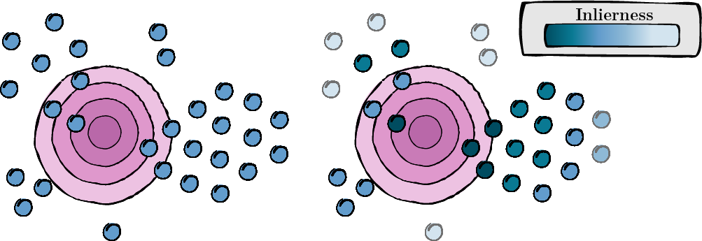
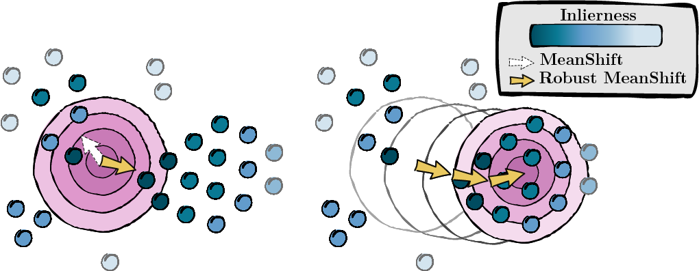

# On the Test-Time Zero-Shot Generalization of Vision-Language Models: Do We Really Need Prompt Learning? [accepted at CVPR 2024]

This is the official GitHub repository for our paper accepted at CVPR '24. 
This work introduces the MeanShift Test-time Augmentation (MTA) method, leveraging Vision-Language models without the necessity for prompt learning. Our method randomly augments a single image into N augmented views, then alternates between two key steps (see [mta.py](mta.py) and [Detailed Code Explanation](#detailed-code-explanation) section.):

### 1. Computing a Score for Each Augmented View

This step involves calculating a score for each augmented view to assess its relevance and quality (inlierness score).

<p align="center">
  
  <br>
  <em>Figure 1: Score computation for augmented views.</em>
</p>

### 2. Seeking for the Mode

Based on the scores computed in the previous step, we seek the mode of the data (MeanShift).

<p align="center">
  
  <br>
  <em>Figure 2: Seeking the mode, weighted by score.</em>
</p>


## Dataset Preparation and Installation

We follow TPT installation and preprocessing. This ensures that your dataset is formatted appropriately. You can find their repository [here](https://github.com/azshue/TPT).
If more convenient you can change the folder names of each dataset in the dictionnary ID_to_DIRNAME in [data/datautils.py](data/datautils.py) (line 20).

## Quick Start Guide

### Running MTA

Execute MTA on the ImageNet dataset with a random seed of 1 and 'a photo of a' prompt by entering the following command:

```bash
python main.py --data /path/to/your/data --mta --testsets I --seed 1
```

Or the 15 datasets at once:

```bash
python main.py --data /path/to/your/data --mta --testsets I/A/R/V/K/DTD/Flower102/Food101/Cars/SUN397/Aircraft/Pets/Caltech101/UCF101/eurosat --seed 1
```

## More details on the code in [mta.py](mta.py)

### Function: `gaussian_kernel`
- **Purpose**: Computes the Gaussian kernel density estimate of data points relative to the mode.
- **Process**:
  - Computes the Euclidean distance between each datapoint and the mode.
  - Applies the Gaussian function to these distances to compute density values.

### Function: `solve_mta`
- **Purpose**: Solves the MTA alternate procedure.
- **Process**:
  1. **Feature Extraction**: Computes image and text features.
  2. **Initialization**:
     - Calculates pairwise distances among image features to determine the bandwidth for the Gaussian kernel.
     - Initializes the affinity matrix based on the softmax of scaled logits.
     - Sets initial values for inlierness scores (`y`) uniformly.
  3. **Iterative Refinement**:
     - Alternates between updating inlierness scores and the mode.
  4. **Output Calculation**: Computes the final output by mapping the refined mode to text features.

## Citation

If you find this project useful, please cite it as follows:

```bibtex
@article{zanella2024test,
  title={On the test-time zero-shot generalization of vision-language models: Do we really need prompt learning?},
  author={Zanella, Maxime and Ayed, Ismail Ben},
  journal={arXiv preprint arXiv:2405.02266},
  year={2024}
}
```

## Acknowledgement

We express our gratitude to the TPT authors for their open-source contribution. You can find their repository [here](https://github.com/azshue/TPT). 

